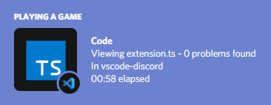
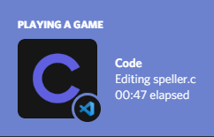

# Yet another Discord Presence

 

## Features

- Displaying file, workspace and language name

- Showing the number of lines in your file and which line you're editing

- Idle indication or full deactivation of the rich presence when you tab out for a while

- Icons for most filetypes used in programming

- If you're brave, an indication of the amount of problems in your workspace

### Note:
> All text is fully customizable using variables and a multitude of config options

## Requirements

### [Discord desktop installation](https://discord.com/download)

> **Linux users:** Note that discord versions installed using `flatpak` or `snap` need modifications in order to support IPC. 
> You are much better off installing discord from the official repositories of your linux distribution. ([Flatpak thread](https://github.com/flathub/com.discordapp.Discord/issues/29))
