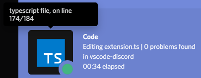
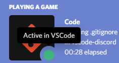

# Yet another Discord Presence

## Features

Features include indication of:

- File, Language and Project name

- Introducing VSCode Status: Are you actually coding or tabbed out?

- If you're editing, debugging or just viewing a file

- For how long you've been editing your current file 

- If your file is unsaved

- Amount of lines in your file

- The line you're currently editing

- Icons for most filetypes used in programming

## Requirements

### [Discord desktop installation](https://discord.com/download)

## Credits

### [File icons by Laurent Treguier](https://github.com/LaurentTreguier/vscode-simple-icons)